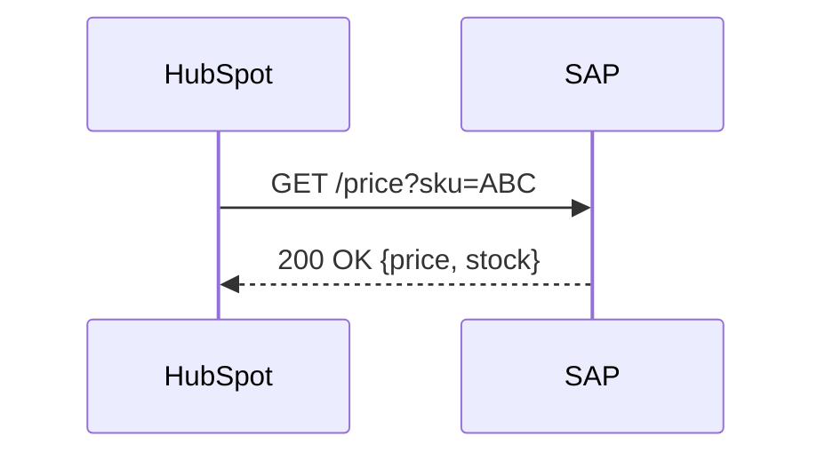

# Propuesta técnica


## Secuencia

```mermaid
sequenceDiagram
participant H as HubSpot
participant S as SAP
H->>S: GET /price?sku=ABC
S-->>H: 200 OK {price, stock}
```


## Comparativa
```chart
title: Costos estimados
type: bar
data:
labels: ["API", "Plantillas", "QA"]
series:
- name: "Horas"